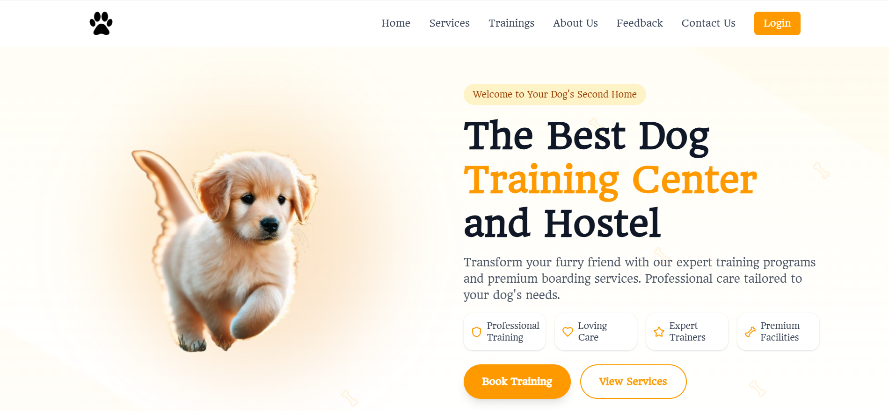
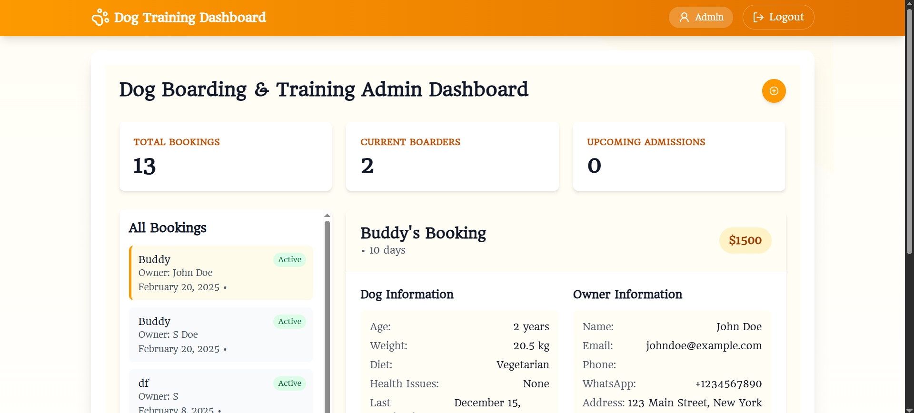
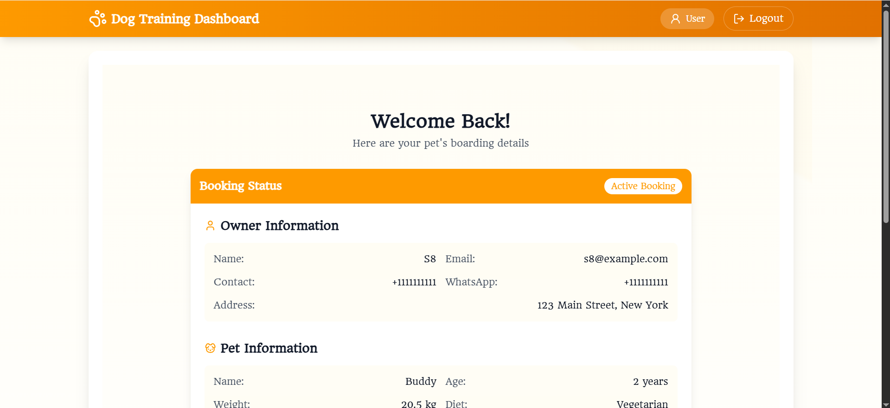

# 🐾 Pet Management App

A personalized pet management app for tracking pet stays, training, and care — while streamlining admin tasks. Built for pet owners, pet care businesses, and service providers.


## 🌐 Live Demo

https://pet-management-app.vercel.app/


## Features

- 📋 Track pet stays and training sessions
- 🐶 Manage pet profiles and activities
- 🧑‍💼 Admin and Pet Parents dashboard for efficient workflow
- 📆 Scheduling and status tracking
- 🔐 Authentication with secure JWT tokens


## Tech Stack

Client:
- ⚛️ React + Vite
- 🎨 Tailwind CSS
- 🌐 React Router

Server: 
- 🛠 Node.js + Express
- 🗄 MongoDB (Mongoose)


## Run Locally

Clone the project

```bash
https://github.com/surajdudhatra02/Pet-Management-App.git
```

Go to the project directory

-- Frontend
```bash
  cd frontend 
```

Install dependencies

```bash
  npm install
```

Start the server

```bash
  npm run dev
```

-- Backend
```bash
  cd backend 
```

Install dependencies

```bash
  npm install
```

Start the server

```bash
  npm start 
```


## Environment Variables

To run this project, you will need to add the following environment variables to your .env file of the backend

`MONGO_URI` 
`JWT_SECRET`
`JWT_EXPIRES`


## Authors

- [Suraj Dudhatra](https://www.github.com/surajdudhatra02)


## Screenshots





